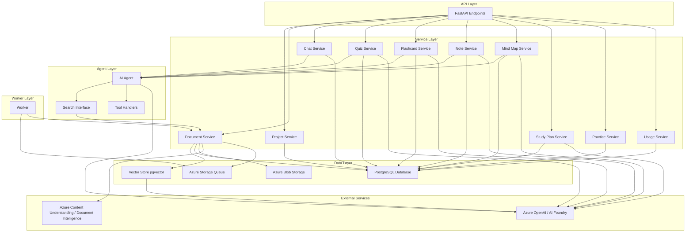

# Architecture

## System Components



## Data Flow

### Document Processing

```
Upload → Blob Storage → Queue → Worker → Content Understanding →
Text Extraction → Segmentation → Embedding Generation → Vector Storage → Ready for Search
```

### Chat Flow

```
User Message → RAG Search → Document Retrieval → Context Building →
AI Agent → Tool Execution (if needed) → Streaming Response → Save History
```

### Quiz / Flashcard / Note / Mind Map Generation

```
User Request → Document Search → Content Extraction → AI Generation →
Validation → Database Storage → Return Results
```

## Database Schema (Conceptual)

### Core Entities

- `users`: User accounts.
- `projects`: Learning projects.
- `documents`: Uploaded documents.
- `document_segments`: Document chunks with embeddings.
- `chats`: Chat conversations.
- `quizzes`: Quiz containers.
- `quiz_questions`: Individual quiz questions.
- `flashcard_groups`: Flashcard containers.
- `flashcards`: Individual flashcards.
- `flashcard_progress`: Simple flashcard mastery/progress tracking.
  - `practice_records`: Practice attempt tracking (flashcards + quizzes).
- `study_plans`: Personalized study plans.
- `notes`: AI-generated study notes.
- `mind_maps`: Visual knowledge maps.
- `user_usage`: Daily usage tracking.

### Relationships

- Users own Projects.
- Projects contain Documents, Chats, Quizzes, Flashcard Groups, Notes, Mind Maps, and Practice Records.
- Documents have Document Segments.
- Quizzes have Quiz Questions.
- Flashcard Groups have Flashcards.
- Users have FlashcardProgress records (one per flashcard per user).
  - Users have Practice Records (one-to-many).
- Users have Study Plans (one-to-many).
- Users have Usage records.

## Vector Search

The system uses PostgreSQL with pgvector extension for semantic search:

- Embeddings are 3072-dimensional vectors (using `text-embedding-3-large` model).
- Cosine similarity is used for search.
- Segments are filtered by project and document.
- Top-K results are returned with relevance scores.
- Vector search is performed using LangChain's `PGVectorStore`.

## Authentication

The system uses Supabase authentication:

- Users are identified by Supabase user ID (UUID).
- Authentication is handled via Supabase Auth.
- JWT tokens are validated using Supabase JWT secret.
- User context is passed through API dependencies.

## Error Handling

The system includes comprehensive error handling:

- Validation errors return **400 Bad Request**.
- Not found errors return **404 Not Found**.
- Usage limit errors return **429 Too Many Requests**.
- Server errors return **500 Internal Server Error**.
- All errors are logged for debugging.

## Performance Considerations

- **Async Processing**: Document processing happens in background via worker.
- **Batch Operations**: Multiple documents can be uploaded simultaneously.
- **Streaming**: Chat responses stream in real-time.
- **Rate Limiting**: Embedding generation includes simple rate limiting.
- **Caching**: Vector store connections are reused.
- **Connection Pooling**: Database connections are pooled.
