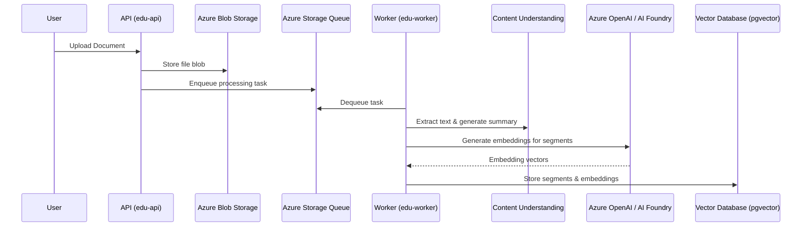

# EduAgent Features

## Table of Contents

1. [Overview & Core Concepts](#overview)
2. [Projects](features/PROJECTS.md)
3. [Documents](features/DOCUMENTS.md)
4. [Chat](features/CHAT.md)
5. [Quizzes](features/QUIZZES.md)
6. [Flashcards](features/FLASHCARDS.md)
7. [Notes](features/NOTES.md)
8. [Mind Maps](features/MIND_MAPS.md)
9. [Practice Records](features/PRACTICE.md)
10. [Usage Limits](features/USAGE_LIMITS.md)
11. [Architecture](ARCHITECTURE.md)
12. [Best Practices & Limitations](BEST_PRACTICES.md)

## Overview & Core Concepts

### Overview

The EduAgent is an AI-powered learning platform that helps students study course materials through intelligent document processing, interactive chat, and AI-generated study aids. The system processes uploaded documents, extracts content using Azure Content Understanding, creates vector embeddings for semantic search, and generates quizzes and flashcards automatically.

### Project-Based Organization

All content is organized within **Projects**. A project represents a course or subject area and contains:

- Documents (course materials and notes)
- Chats (conversations with the AI tutor)
- Quizzes (AI-generated multiple-choice questions)
- Flashcard groups (AI-generated study cards)
- Notes (AI-generated study notes)
- Mind Maps (visual knowledge representations)
- Study sessions and practice records (tracking of user progress)

Each project has a language code that determines the language used for AI-generated content.

### Document Processing Pipeline

Documents go through several processing stages:

1. **UPLOADED** - Initial upload to blob storage
2. **PROCESSING** - Text extraction in progress
3. **PROCESSED** - Text extracted and stored
4. **INDEXED** - Segments created and embeddings generated
5. **FAILED** - Processing encountered an error
