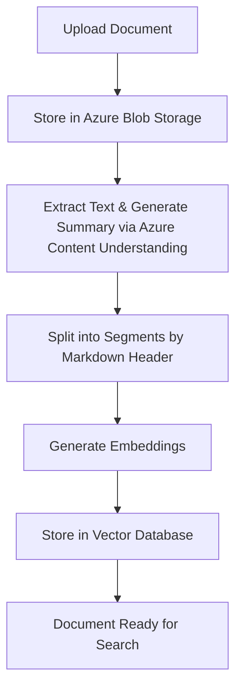
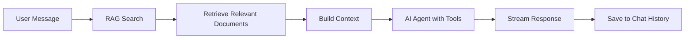
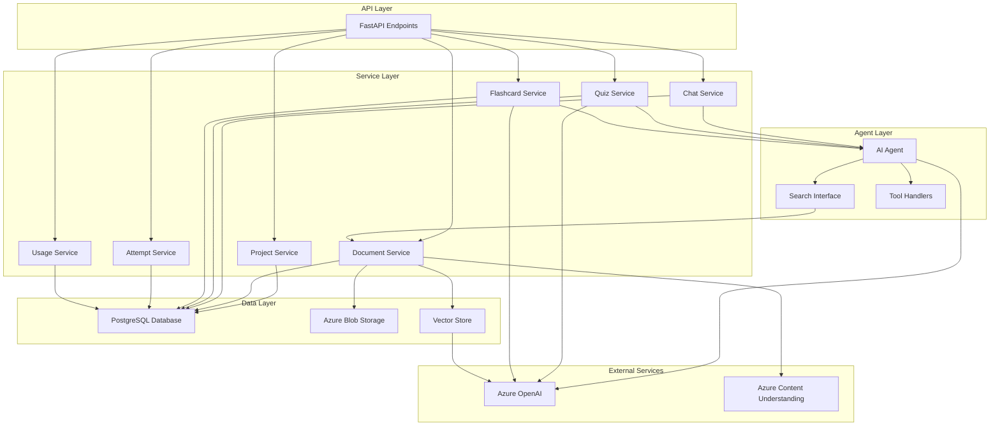

# EduAgent Application Documentation

## Table of Contents

1. [Overview](#overview)
2. [Core Concepts](#core-concepts)
3. [Projects](#projects)
4. [Documents](#documents)
5. [Chat](#chat)
6. [Quizzes](#quizzes)
7. [Flashcards](#flashcards)
8. [Study Attempts](#study-attempts)
9. [Usage Limits](#usage-limits)
10. [Architecture](#architecture)

## Overview

The EduAgent is an AI-powered learning platform that helps students study course materials through intelligent document processing, interactive chat, and AI-generated study aids. The system processes uploaded documents, extracts content using Azure Content Understanding, creates vector embeddings for semantic search, and generates quizzes and flashcards automatically.

## Core Concepts

### Project-Based Organization

All content is organized within **Projects**. A project represents a course or subject area and contains:

- Documents (PDF, DOCX, TXT, RTF files)
- Chats (conversations with the AI tutor)
- Quizzes (AI-generated multiple-choice questions)
- Flashcard groups (AI-generated study cards)
- Study attempts (tracking of user progress)

Each project has a language code that determines the language used for AI-generated content.

### Document Processing Pipeline



Documents go through several processing stages:

1. **UPLOADED** - Initial upload to blob storage
2. **PROCESSING** - Text extraction in progress
3. **PROCESSED** - Text extracted and stored
4. **INDEXED** - Segments created and embeddings generated
5. **FAILED** - Processing encountered an error

## Projects

Projects are the top-level organizational unit for all educational content.

### Features

- **Create Projects**: Set up a new learning project with name, description, and language
- **List Projects**: View all projects owned by the user
- **Get Project**: Retrieve project details
- **Update Project**: Modify project name, description, or language code
- **Delete Project**: Remove a project and all associated content

### Project Properties

- `id`: Unique identifier
- `owner_id`: User who owns the project
- `name`: Project name (must be unique per user)
- `description`: Optional project description
- `language_code`: Language for AI-generated content (default: "en")
- `created_at`: Timestamp when project was created

### Language Support

Projects support different languages through the `language_code` field. When generating quizzes, flashcards, or chat responses, the AI will use the project's language code to ensure content is generated in the appropriate language.

## Documents

Documents are the foundation of the learning system. Users upload documents that are processed, indexed, and made searchable for use in chat, quiz generation, and flashcard creation.

### Document Upload

**Supported File Types:**

- PDF (.pdf)
- Microsoft Word (.docx, .doc)
- Plain Text (.txt)
- Rich Text Format (.rtf)

**Upload Process:**

1. User uploads one or more files
2. Files are immediately stored in Azure Blob Storage
3. Document records are created in the database with status "UPLOADED"
4. Background processing begins automatically:
   - Text extraction & summary generation using Azure Content Understanding
   - Document segmentation
   - Embedding generation
   - Vector indexing

**Batch Upload:**
Multiple documents can be uploaded simultaneously. Each file is processed independently in the background.

### Document Processing

Documents are processed asynchronously using Azure Content Understanding:

1. **Text Extraction**: The document is analyzed to extract structured markdown content
2. **Summary Generation**: An automatic summary is generated from the document content
3. **Segmentation**: Content is split into chunks using:
   - Page breaks (marked with `<!-- PageBreak -->`)
   - Markdown headers (H1, H2, H3)
   - Recursive text splitting with overlap
4. **Embedding Generation**: Each segment gets a 3072-dimensional vector embedding
5. **Vector Storage**: Embeddings are stored in PostgreSQL with pgvector extension

### Document Search

Documents are searchable using semantic similarity search:

- **Vector Search**: Uses cosine similarity on embeddings to find relevant content
- **Project Scoping**: Searches are limited to documents within a specific project
- **Top-K Results**: Returns the most relevant document segments
- **Score Ranking**: Results include relevance scores

### Document Features

- **List Documents**: View all documents in a project
- **Get Document**: Retrieve document metadata and status
- **Preview Document**: Stream document content for viewing in browser
- **Delete Document**: Remove document and all associated data (blobs, segments, embeddings)

### Document Status

Documents have the following statuses:

- `UPLOADED`: File uploaded, processing not started
- `PROCESSING`: Text extraction in progress
- `PROCESSED`: Text extracted, awaiting indexing
- `INDEXED`: Fully processed and searchable
- `FAILED`: Processing encountered an error

### Document Segments

Each document is split into multiple segments for better search granularity:

- Segments preserve document structure (headers, page breaks)
- Each segment has its own embedding vector
- Segments are searchable independently
- Segments maintain references to their parent document

## Chat

The Chat feature provides an AI-powered tutor that answers questions based on uploaded documents using Retrieval Augmented Generation (RAG).

### Chat Architecture



### Chat Features

- **Create Chat**: Start a new conversation thread
- **List Chats**: View all chats in a project
- **Get Chat**: Retrieve full chat history
- **Update Chat**: Modify chat title
- **Delete Chat**: Remove a chat conversation
- **Streaming Messages**: Real-time streaming responses

### RAG (Retrieval Augmented Generation)

When a user sends a message:

1. **Document Retrieval**: The system searches project documents for relevant content
2. **Context Building**: Top 5 most relevant document segments are retrieved
3. **Citation**: Each retrieved segment is numbered and included as context
4. **AI Response**: The AI generates a response based on the retrieved context
5. **Source Attribution**: Responses include citations to source documents

### Chat Tools

The AI agent has access to tools that can be invoked when requested:

- **Flashcard Creation**: Generate flashcards from documents
- **Quiz Creation**: Generate quizzes from documents
- **Document Search**: Search for specific information

Tools are only executed when explicitly requested by the user (e.g., "create flashcards about photosynthesis").

### Streaming Responses

Chat responses are streamed in real-time:

- Responses arrive as chunks as they are generated
- Sources are included in the stream
- Tool calls are reported as they occur
- Full message is saved when streaming completes

### Chat Messages

Each chat contains a list of messages with:

- `role`: "user", "assistant", or "internal"
- `content`: Message text
- `sources`: List of cited documents (for assistant messages)
- `tools`: List of tool calls made (for assistant messages)
- `created_at`: Timestamp

### Auto-Generated Titles

The first message in a chat automatically generates a title based on the conversation content. Titles are concise (max 5 words) and descriptive.

### Language Support

Chat responses respect the project's language code. All AI responses are generated in the project's specified language.

## Quizzes

Quizzes are AI-generated multiple-choice questions created from project documents.

### Quiz Generation

**Process:**

1. User requests quiz creation (via API or chat)
2. System searches project documents for relevant content
3. AI analyzes document content
4. AI generates quiz name, description, and questions
5. Questions are saved to the database

**Generation Parameters:**

- `count`: Number of questions to generate (typically 10-30)
- `user_prompt`: Optional instructions for topic filtering or focus
- `project_id`: Project containing source documents

### Quiz Structure

Each quiz contains:

- **Name**: Auto-generated concise title (2-6 words)
- **Description**: Brief explanation of quiz content (1-2 sentences)
- **Questions**: Multiple-choice questions with:
  - Question text
  - Four options (A, B, C, D)
  - Correct answer (a, b, c, or d)
  - Explanation for the correct answer
  - Difficulty level (easy, medium, hard)

### Quiz Features

- **Create Quiz**: Generate a new quiz from documents
- **List Quizzes**: View all quizzes in a project
- **Get Quiz**: Retrieve quiz details
- **Get Questions**: List all questions in a quiz
- **Submit Answers**: Submit quiz answers and get results
- **Delete Quiz**: Remove a quiz and all its questions

### Quiz Submission

When submitting quiz answers:

1. User provides answers as a mapping of question IDs to selected options
2. System evaluates each answer
3. Results include:
   - Total questions
   - Number correct
   - Score percentage
   - Letter grade (A-F)
   - Per-question results with explanations

**Grading Scale:**

- A: 90-100%
- B: 80-89%
- C: 70-79%
- D: 60-69%
- F: Below 60%

### Topic Filtering

Quizzes can be generated from specific topics by providing a `user_prompt`:

- The prompt is used to search for relevant documents
- Only matching document content is used for generation
- Allows focused quiz creation on specific subjects

### Question Quality

Generated questions follow these guidelines:

- Test understanding, not just memorization
- Mix of difficulty levels
- Cover key concepts, definitions, and applications
- Clear and concise wording
- Plausible but clearly wrong distractors
- Detailed explanations for correct answers

## Flashcards

Flashcards are AI-generated study cards created from project documents.

### Flashcard Generation

**Process:**

1. User requests flashcard creation (via API or chat)
2. System searches project documents for relevant content
3. AI analyzes document content
4. AI generates flashcard group name, description, and flashcards
5. Flashcards are saved to the database

**Generation Parameters:**

- `count`: Number of flashcards to generate (typically 15-30)
- `user_prompt`: Optional instructions for topic filtering or focus
- `project_id`: Project containing source documents

### Flashcard Structure

Flashcards are organized into groups. Each group contains:

- **Name**: Auto-generated concise title (2-6 words)
- **Description**: Brief explanation of flashcard content (1-2 sentences)
- **Flashcards**: Individual cards with:
  - Question
  - Answer
  - Difficulty level (easy, medium, hard)

### Flashcard Features

- **Create Flashcard Group**: Generate a new group with flashcards
- **List Groups**: View all flashcard groups in a project
- **Get Group**: Retrieve group details
- **Get Flashcards**: List all flashcards in a group
- **Update Group**: Modify group name or description
- **Delete Group**: Remove a group and all its flashcards

### Topic Filtering

Flashcards can be generated from specific topics by providing a `user_prompt`:

- The prompt is used to search for relevant documents
- Only matching document content is used for generation
- Allows focused flashcard creation on specific subjects

### Flashcard Quality

Generated flashcards follow these guidelines:

- Test understanding, not just memorization
- Mix of difficulty levels
- Cover key concepts, definitions, and applications
- Clear and concise questions
- Comprehensive but concise answers
- Focus on important educational content

## Study Attempts

Study Attempts track user progress when studying flashcards or taking quizzes.

### Attempt Recording

Each attempt records:

- `user_id`: User who made the attempt
- `project_id`: Project context
- `item_type`: "flashcard" or "quiz"
- `item_id`: ID of the flashcard or quiz question
- `topic`: Extracted topic from the question/flashcard
- `user_answer`: User's answer (for quizzes; null for flashcards)
- `correct_answer`: The correct answer
- `was_correct`: Whether the user got it right
- `created_at`: Timestamp

### Attempt Features

- **Create Attempt**: Record a single study attempt
- **Create Batch**: Record multiple attempts in one operation
- **List Attempts**: View all attempts for a user (optionally filtered by project)

### Use Cases

Study attempts enable:

- **Progress Tracking**: Monitor learning progress over time
- **Performance Analytics**: Analyze correct/incorrect patterns
- **Topic Analysis**: Identify which topics need more practice
- **Spaced Repetition**: Track when items were last studied

### Validation

The system validates that referenced items exist:

- Flashcard attempts must reference valid flashcards
- Quiz attempts must reference valid quiz questions
- Invalid references are rejected

## Usage Limits

The system enforces daily usage limits to manage resource consumption.

### Usage Types

Four types of usage are tracked:

1. **Chat Messages**: Number of chat messages sent per day
2. **Flashcard Generations**: Number of flashcard groups created per day
3. **Quiz Generations**: Number of quizzes created per day
4. **Document Uploads**: Number of documents uploaded per day

### Daily Limits

Each usage type has a configurable daily limit. Limits reset at midnight UTC.

### Usage Tracking

- **Check Before Action**: Limits are checked before allowing an action
- **Automatic Increment**: Counters increment when actions succeed
- **Daily Reset**: Counters reset automatically each day
- **Per-User Tracking**: Each user has independent usage counters

### Usage Features

- **Get Usage**: View current usage statistics and limits
- **Automatic Enforcement**: System prevents actions when limits are exceeded
- **Error Handling**: Clear error messages when limits are reached

### Usage Statistics

Usage statistics include:

- `used`: Current count for the day
- `limit`: Maximum allowed per day
- Available for all four usage types

## Architecture

### System Components



### Data Flow

**Document Processing:**

```
Upload → Blob Storage → Content Understanding → Text Extraction →
Segmentation → Embedding Generation → Vector Storage → Ready for Search
```

**Chat Flow:**

```
User Message → RAG Search → Document Retrieval → Context Building →
AI Agent → Tool Execution (if needed) → Streaming Response → Save History
```

**Quiz/Flashcard Generation:**

```
User Request → Document Search → Content Extraction → AI Generation →
Validation → Database Storage → Return Results
```

### Database Schema

**Core Entities:**

- `users`: User accounts
- `projects`: Learning projects
- `documents`: Uploaded documents
- `document_segments`: Document chunks with embeddings
- `chats`: Chat conversations
- `quizzes`: Quiz containers
- `quiz_questions`: Individual quiz questions
- `flashcard_groups`: Flashcard containers
- `flashcards`: Individual flashcards
- `study_attempts`: User study progress
- `user_usage`: Daily usage tracking

**Relationships:**

- Users own Projects
- Projects contain Documents, Chats, Quizzes, Flashcard Groups
- Documents have Document Segments
- Quizzes have Quiz Questions
- Flashcard Groups have Flashcards
- Users make Study Attempts
- Users have Usage records

### Vector Search

The system uses PostgreSQL with pgvector extension for semantic search:

- Embeddings are 3072-dimensional vectors
- Cosine similarity is used for search
- Segments are filtered by project and document
- Top-K results are returned with relevance scores

### Authentication

The system uses Azure AD authentication:

- Users are identified by Azure Object ID (OID)
- Authentication is handled via Azure Identity
- User context is passed through API dependencies

### Error Handling

The system includes comprehensive error handling:

- Validation errors return 400 Bad Request
- Not found errors return 404 Not Found
- Usage limit errors return 429 Too Many Requests
- Server errors return 500 Internal Server Error
- All errors are logged for debugging

### Performance Considerations

- **Async Processing**: Document processing happens in background
- **Batch Operations**: Multiple documents can be uploaded simultaneously
- **Streaming**: Chat responses stream in real-time
- **Rate Limiting**: Embedding generation includes rate limiting
- **Caching**: Vector store connections are reused
- **Connection Pooling**: Database connections are pooled

## Best Practices

### Document Management

1. **Upload Quality Documents**: Use well-structured documents with clear headings
2. **Wait for Processing**: Allow time for documents to be fully indexed before use
3. **Monitor Status**: Check document status before generating quizzes/flashcards
4. **Organize by Project**: Group related documents in the same project

### Quiz Generation

1. **Provide Context**: Use user prompts to focus quiz generation on specific topics
2. **Reasonable Counts**: Generate 10-30 questions for optimal quality
3. **Review Questions**: Check generated questions for accuracy
4. **Use Results**: Submit quiz answers to track progress

### Flashcard Creation

1. **Topic Focus**: Use prompts to create focused flashcard sets
2. **Study Regularly**: Use study attempts to track learning
3. **Mix Difficulties**: Generated flashcards include various difficulty levels
4. **Review Answers**: Study both questions and answers

### Chat Usage

1. **Be Specific**: Ask specific questions for better answers
2. **Use Citations**: Check source citations for verification
3. **Request Tools**: Explicitly request quiz/flashcard creation when needed
4. **Review History**: Use chat history to track learning progress

### Project Organization

1. **One Subject Per Project**: Keep projects focused on single subjects
2. **Set Language**: Configure language code for non-English content
3. **Descriptive Names**: Use clear project names for easy identification
4. **Regular Cleanup**: Delete unused projects to manage storage

## Limitations

- **File Size**: Large documents may take longer to process
- **Daily Limits**: Usage limits reset daily, not per hour
- **Language Support**: Quality depends on Azure OpenAI language capabilities
- **Processing Time**: Document processing is asynchronous and may take time
- **Storage**: Blob storage and database storage have capacity limits

## Support

For issues or questions:

1. Check document processing status
2. Verify usage limits haven't been exceeded
3. Review error messages in API responses
4. Check logs for detailed error information
