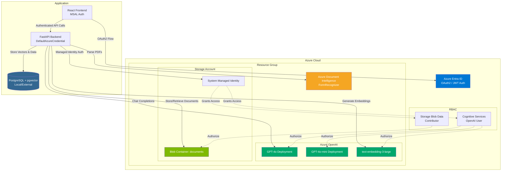

# System Architecture

## Overview

EduAgent is an AI-powered educational platform built with a Python FastAPI backend and React frontend. It provides document processing, RAG-based chat, and AI-generated learning materials (flashcards and quizzes).

## Tech Stack

### Backend

- **Framework**: FastAPI (Python)
- **Database**: PostgreSQL with pgvector extension
- **ORM**: SQLAlchemy
- **AI/ML**: LangChain + Azure OpenAI

### Frontend

- **Framework**: React with TypeScript
- **Build Tool**: Vite
- **State Management**: TanStack Query
- **Auth**: MSAL (Microsoft Authentication Library)

### Azure Services

- **Azure Entra ID**: Authentication & authorization
- **Azure Blob Storage**: Document storage
- **Azure Document Intelligence**: PDF/document parsing
- **Azure OpenAI**: Chat completion & embeddings (text-embedding-3-large, gpt-4o)

## Cloud Infrastructure



**Infrastructure Notes:**

- All Azure resources provisioned via Terraform
- Managed Identity for passwordless authentication between services
- RBAC roles assigned for fine-grained access control
- PostgreSQL runs externally (not in Azure due to cost optimization)

## Architecture Pattern

**Layered Architecture**:

```
API Layer (FastAPI Routes)
    ↓
Service Layer (Business Logic)
    ↓
Data Layer (SQLAlchemy Models + PostgreSQL)
```

## Core Services

### DocumentService

- Document upload to Azure Blob Storage
- PDF processing via Azure Document Intelligence
- Text chunking and embedding generation
- Vector search using PostgreSQL pgvector
- RAG (Retrieval Augmented Generation) responses

### ChatService

- Project-scoped chat sessions
- Grounded responses using RAG
- Streaming support for real-time responses
- Chat history management

### ProjectService

- Multi-language project support
- User-scoped project management
- CRUD operations

### FlashcardService

- AI-generated flashcards from project documents
- Difficulty levels (easy, medium, hard)
- Multi-language support
- Uses RAG to ground flashcard generation

### QuizService

- AI-generated multiple-choice quizzes
- Difficulty levels (easy, medium, hard)
- Explanations for correct answers
- Multi-language support
- Uses RAG to ground quiz generation

## Data Models

### Core Entities

- **User**: Azure Entra authenticated users
- **Project**: User-owned learning projects (with language support)
- **Document**: Uploaded files with processing status
- **DocumentSegment**: Chunked text with embeddings (3072-dim vectors)
- **Chat**: Project-scoped conversations with message history
- **FlashcardGroup**: Collections of flashcards
- **Flashcard**: Q&A pairs with difficulty
- **Quiz**: Collections of questions
- **QuizQuestion**: Multiple-choice questions with explanations

## API Structure

**Base URL**: `/v1`

### Endpoints

- `/auth/*` - User authentication
- `/projects/*` - Project management
- `/documents/*` - Document upload & processing
- `/chats/*` - Chat sessions & messaging
- `/flashcards/*` - Flashcard generation & management
- `/quizzes/*` - Quiz generation & management

### Authentication

- Azure Entra ID OAuth2 with JWT tokens
- Bearer token authentication on all protected endpoints
- Auto user creation/update on first login

## Document Processing Pipeline

1. **Upload**: File → Azure Blob Storage
2. **Parse**: Azure Document Intelligence extracts text + layout
3. **Chunk**: RecursiveCharacterTextSplitter (1000 chars, 200 overlap)
4. **Embed**: Azure OpenAI text-embedding-3-large (3072 dimensions)
5. **Store**: PostgreSQL with pgvector for similarity search
6. **Query**: Vector search + LLM for grounded responses

## RAG Implementation

- **Retrieval**: pgvector similarity search (cosine distance)
- **Augmentation**: Top-K relevant chunks added to prompt context
- **Generation**: Azure OpenAI GPT-4o with chat history
- **Grounding**: Responses cite source documents
- **Streaming**: Token-by-token response for better UX

## Configuration

Environment variables managed through `.env`:

- Database connection
- Azure service credentials & endpoints
- OpenAI model deployments
- Azure Entra tenant/client IDs

See `server/core/config.py` for all settings.

## Deployment

- **Infrastructure**: Terraform (in `infra/`)
- **Containerization**: Docker Compose support
- **Database Migrations**: Alembic
