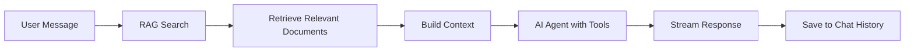

# Chat

The Chat feature provides an AI-powered tutor that answers questions based on uploaded documents using Retrieval Augmented Generation (RAG).

## Chat Architecture

## Chat Features

- **Create Chat**: Start a new conversation thread.
- **List Chats**: View all chats in a project.
- **Get Chat**: Retrieve full chat history.
- **Update Chat**: Modify chat title.
- **Delete Chat**: Remove a chat conversation.
- **Streaming Messages**: Real-time streaming responses.

## RAG (Retrieval Augmented Generation)

When a user sends a message:

1. **Document Retrieval**: The system searches project documents for relevant content.
2. **Context Building**: Top 5 most relevant document segments are retrieved.
3. **Citation**: Each retrieved segment is numbered and included as context.
4. **AI Response**: The AI generates a response based on the retrieved context.
5. **Source Attribution**: Responses include citations to source documents.

## Chat Tools

The AI agent has access to tools that can be invoked when requested:

- **Flashcard Creation**: Generate flashcards from documents using a topic and custom instructions.
- **Quiz Creation**: Generate quizzes from documents using a topic and custom instructions.
- **Document Search**: Search for specific information.

Tools are only executed when explicitly requested by the user (e.g., "create 20 hard flashcards about photosynthesis" or "generate a medium-difficulty quiz on Chapter 3").

## Streaming Responses

Chat responses are streamed in real-time:

- Responses arrive as chunks as they are generated.
- Sources are included in the stream.
- Tool calls are reported as they occur.
- Full message is saved when streaming completes.

## Chat Messages

Each chat contains a list of messages with:

- `role`: `"user"`, `"assistant"`, or `"internal"`.
- `content`: Message text.
- `sources`: List of cited documents (for assistant messages).
- `tools`: List of tool calls made (for assistant messages).
- `created_at`: Timestamp.

## Auto-Generated Titles

The first message in a chat automatically generates a title based on the conversation content. Titles are concise (max 5 words) and descriptive.

## Language Support

Chat responses respect the project's language code. All AI responses are generated in the project's specified language.

