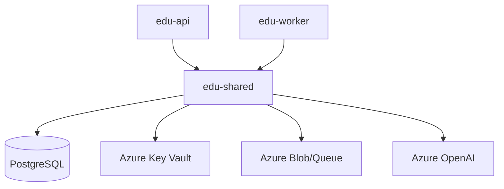

# Service Architecture Snapshot

Focused architecture for `edu-shared` (Python shared library). This package is not deployed on its own; it is embedded into `edu-api` and `edu-worker` images.

## Context
- **Purpose**: Shared, reusable backend building blocks: DB models, typed schemas/DTOs, domain services, queue schemas, and common integrations.
- **Upstream dependents**:
  - `edu-api` (FastAPI) imports `edu_shared.services.*`, `edu_shared.schemas.*`, `edu_shared.db.*`
  - `edu-worker` imports `edu_shared.schemas.*`, `edu_shared.db.*`, and `edu_shared.services.*`
- **Downstream dependencies** (via helper modules):
  - PostgreSQL via SQLAlchemy
  - Azure SDKs (Key Vault, Storage)
  - Azure Identity (managed identity / DefaultAzureCredential)
  - LangChain PGVector + Azure OpenAI embeddings (in search/embedding helpers)

## Component Diagram

## Data Flow
- **DB access**: `edu_shared.db.session.init_db()` is called by host apps at startup, then services use `get_session_factory()` to run CRUD.
- **Async work**: queue message schema lives in `edu_shared.schemas.queue` and is used by producers (`edu-api`) and consumers (`edu-worker`).
- **RAG search**: `edu_shared.services.search.SearchService` performs vector search over `document_segments.embedding_vector` using LangChain PGVector.

## Cross-Cutting Concerns
- **Configuration**: settings sources can pull secrets from Key Vault and fall back to environment variables.
- **Coupling**: DB models + queue message schemas are shared contracts; changes require coordinated updates to `edu-api` and `edu-worker`.
