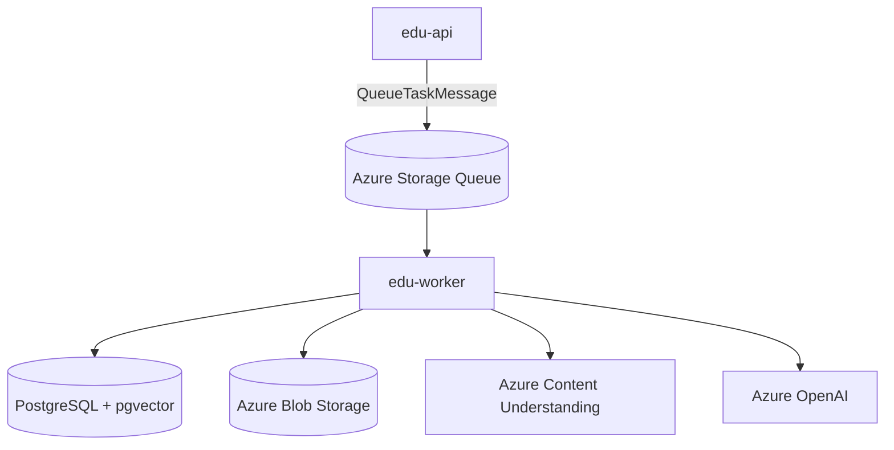

# Service Architecture Snapshot

Focused architecture for `edu-worker` (background processor). For system-wide context see:
- `../../../docs/ARCHITECTURE.md`

## Context
- **Purpose**: Consume Azure Storage Queue tasks and execute long-running AI/document workflows.
- **Upstream**: `edu-api` publishes queue tasks.
- **Downstream dependencies**:
  - Azure Storage Queue (task intake)
  - Azure Blob Storage (read from `input`, write to `output`)
  - Azure Content Understanding (document text + summary extraction)
  - Azure OpenAI (embeddings + LLM generation)
  - PostgreSQL (store segments, embeddings, generated content)

## Component Diagram

## Data Flow
### Queue polling
1. Worker polls `receive_messages(visibility_timeout=300, max_messages=5)`.
2. Message body is Base64 JSON; it is decoded and parsed as `QueueTaskMessage`.
3. `ProcessorRegistry` maps `task_type` → processor.
4. Processor runs and updates DB.
5. On success, message is deleted; on failure, it becomes visible again after timeout.

### Document processing (`DOCUMENT_PROCESSING`)
- Downloads original blob from `input` container.
- Calls Content Understanding analyzer, receives Markdown + Summary.
- Copies original blob to `output`, writes `*.contents.txt` to `output`, deletes input blob.
- Splits content into chunks, writes `document_segments`, generates embeddings via Azure OpenAI.

### AI generation tasks
- `FLASHCARD_GENERATION`, `QUIZ_GENERATION`, `NOTE_GENERATION`, `MIND_MAP_GENERATION` run agents using:
  - `SearchService` (RAG over pgvector)
  - Azure OpenAI chat deployment for generation
- `CHAT_TITLE_GENERATION` creates a short title and updates the `chats` record.

## Cross-Cutting Concerns
- **Concurrency**: uses a `ThreadPoolExecutor(max_workers=5)` and runs async processors per message.
- **Retries**: relies on queue message visibility timeout; failures are logged and naturally retried.
- **Idempotency**: processors should tolerate duplicate deliveries (queue is at-least-once).
- **Secrets/config**: settings can come from Key Vault settings source or `.env`.
